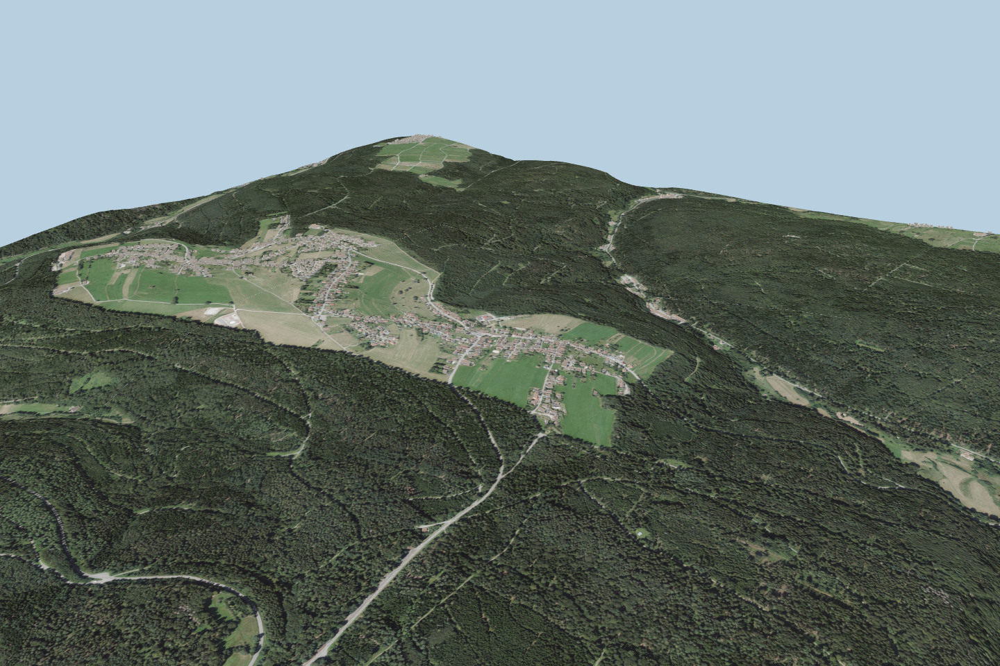

# Neusatz – Cinematic-Grundlage

Geografisch detaillierte 3D-Basis für einen vorgerenderten Neusatz-Cinematic: eine hochaufgelöste Hero-Zone, ein großflächiger Hintergrund und amtliche Gebäudekörper. Enthalten sind alle Modelle, ein lokaler Three.js-Testviewer, Kameravoreinstellungen, Build-Werkzeuge, Prüfberichte und echte WebGL-Screenshots.



| Stufe | Inhalt |
| --- | --- |
| LOD0 | Knapp 2 × 2 km, 16 Terrain-Kacheln mit 1-m-Raster und DOP20 mit 20 cm/Pixel; 816 vollständige LoD2-Gebäude |
| LOD1 | Bytegenau erhaltener 6 × 6 km Background-Master |
| LOD2 | Leichtere 6 × 6 km Fernansicht |

## Start

Repository vollständig klonen oder über **Code → Download ZIP** herunterladen und entpacken. Python 3.11 oder neuer ist erforderlich. Unter Windows `Start_Viewer.bat` öffnen; alternativ im Projektordner:

```sh
python start_viewer.py
```

Dann <http://localhost:8080> öffnen. Der Start setzt den Master automatisch aus drei geprüften Binärteilen zusammen; Git LFS und zusätzliche Python-Pakete sind für den Viewer nicht nötig. Three.js und alle Texturen liegen lokal bei. Übersicht, niedrigen Anflug, Dorf-Nahansicht und Übergangsrand über die Kameratasten wählen; das Auswahlfeld wechselt die LODs bei identischer Kamera.

Für Blender oder Build-Werkzeuge zuerst `python prepare_models.py` ausführen. Der Master liegt danach regulär unter `lod1/neusatz_master.glb`. [Speicherung und Prüfsumme](STORAGE.md).

## Qualitätsstand

Die Geländeform und Gebäudekörper bilden eine gute geografische Grundlage. Sie sind noch kein fotorealistischer Cinematic: Wälder bleiben flache Luftbildstrukturen, Gebäude haben einfache Materialien ohne detaillierte Fassaden. Die Dorfansicht zeigt außerdem die Grenzen des Orthofotos bei niedriger Kamera und lokale Unterschiede zwischen Gebäudegrundflächen und Gelände.

Alle 19 GLBs sind gegenüber dem vollständigen Quellpaket byteidentisch. Kachelpositionen und Normalen stimmen exakt überein; die unabhängige Außenrandprüfung ergibt maximal 0,000031 m Höhenabweichung zum Master. Der Viewer behält Background-Maskierung, Gebäudefilterung und Kantenabdichtung unverändert. Details und aktuelle Browserprüfungen: [lokaler Prüfbericht](local_validation.json), [Paketprüfung](validation.json), [Browserprüfung](current_browser_validation.json).

Die ausführliche ursprüngliche README bleibt unverändert als [TECHNIK.md](TECHNIK.md) erhalten. Der bevorzugte nächste Schritt ist ein vollständig ausgearbeiteter Blender-Testshot von 5–10 Sekunden; danach erst die vollständige Filmsequenz. [Cinematic-Prioritäten](CINEMATIC.md).

## Datenquelle und Lizenzen

Datenquelle: LGL, www.lgl-bw.de, dl-de/by-2-0. Bearbeitete Geodaten: Ausschnitt, lokale Koordinaten, Triangulierung, DOP-Resampling/JPEG und Randangleichung. [LGL-Datenhinweis](build_tools/LGL_DATA_LICENSE.txt). Three.js steht unter [MIT](vendor/THREE_LICENSE.txt). Die vollständigen Roharchive sind nicht enthalten; Bezugsquellen und Prüfsummen stehen in Build-Werkzeugen und Paketprüfung.
